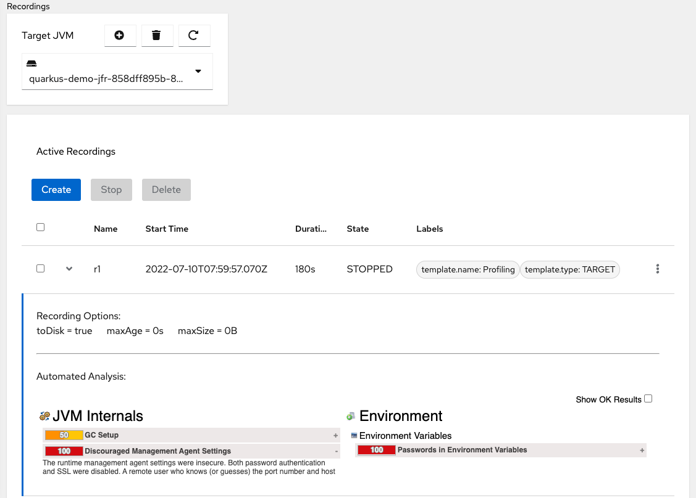
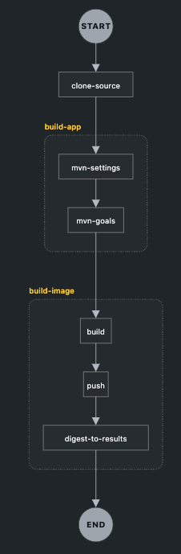
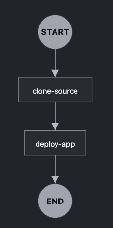
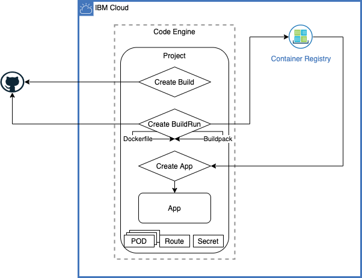

= Quarkus Playground
:author: Hafid Haddouti
:toc: macro
:toclevels: 4
:sectlinks:
:sectanchors:

A link:https://quarkus.io/[Quarkus] playground application. 

toc::[]

== Overview

This playground application using link:https://quarkus.io/[Quarkus] covers various topics like

* Quarkus (v2) itself ;-)
* Kubernetes/OpenShift deployment
* REST/Microservice
* Security aspects

Do not use this application as entire reference for final productive system, but rather for point-of-view and inspiration for the given topics.

== Application Links

.Helpful links
|===
| Home | link:http://127.0.0.1:8080/[]
| Dev UI | link:http://127.0.0.1:8080/q/dev/[]
| Health API | link:http://127.0.0.1:8080/q/health[]
| Health UI | link:http://127.0.0.1:8080/q/health-ui/[]
| Swagger UI | link:http://127.0.0.1:8080/q/swagger-ui/[]
| Metrics API (Prometheus) | link:http://127.0.0.1:8080/q/metrics[]
| | 
| Secured API without role | link:http://127.0.0.1:8080/secured/date[]
| Secured API with role | link:http://127.0.0.1:8080/secured/dateForManager[]
| Secured API with Backend call | link:http://127.0.0.1:8080/secured/user[]
| | 
| Kafka Topic SSE | link:http://127.0.0.1:8080/v1/importantevents[]
| | 
| Simple Echo endpoint | link:http://127.0.0.1:8080/v1/mirror/?e=TestMessage[]
| List requests (from DB) | link:http://127.0.0.1:8080/v1/mirror/list/pairs[]
|===

== Usage

Listing of useful commands

.Helpful start script with setting and overwriting env variables
----
#!/bin/sh

export QUARKUS_OIDC_AUTH_SERVER_URL="https://idp-auth-server-url"
export QUARKUS_OIDC_CLIENT_ID="defined-cient-id"
#export QUARKUS_OIDC_TENANT_ID="defined-tenant-id-if-not-in-URL"
export QUARKUS_OIDC_CREDENTIALS_SECRET="client-secret-value"
export QUARKUS_OIDC_CLIENT_AUTH_SERVER_URL="https://idp-auth-server-url"
export QUARKUS_OIDC_CLIENT_CLIENT_ID="defined-cient-id"
#export QUARKUS_OIDC_CLIENT_TENANT_ID="defined-tenant-id-if-not-in-URL"
export QUARKUS_OIDC_CLIENT_CREDENTIALS_SECRET="client-secret-value"

./mvnw compile quarkus:dev
----

.Run in `dev` mode
----
./mvnw compile quarkus:dev
----
...this builds and executes the app in dev mode. Modification in source code will be detected and automatically applied, without triggering a re-build. This activates also link:https://quarkus.io/guides/continuous-testing[Continuous Testing]

.Package application
----
./mvnw package
----

.Package `über-jar` application
----
./mvnw package -Dquarkus.package.type=uber-jar
----

.Package `native` application
----
./mvnw package -Pnative
----

.Package `native` application without installed GraalVM
----
./mvnw package -Pnative -Dquarkus.native.container-build=true
----

.Package and push container using Dockerfile
----
podman build -f src/main/docker/Dockerfile.jvm_multi -t quarkus-playground:jvm-v2 .

podman login -u $(oc whoami) -p $(oc whoami -t) image-registry.example.com
Login Succeeded!

podman tag quarkus-playground:jvm-v2 image-registry.example.com/test/quarkus-playground:jvm-v2

podman push image-registry.example.com/test/quarkus-playground:jvm-v2
----

.Generate Kubernetes/OpenShift resources from helm but execute directly
----
cd helm
helm3 template rel1 quarkus-playground -f quarkus-playground/values.test.yaml --output-dir=work

oc apply -f work/quarkus-playground/templates/
----

.Update the mvn wrapper
----
./mvnw -N wrapper:wrapper -Dmaven=3.8.5
----

== Technologies

This chapters summarize the integrated technologies and components in the application

|===

| Smallrye OpenAPI | OpenAPI support
| RESTeasy | REST capability
| REST Client | Possibility to use REST endpoints
| Jackson | XML/JSON serialization support for REST endpoints
| Micrometer | Metric support
| Micrometer Prometheus | Prometheus adapter for Micrometer
| OpenTracing | OpenTracing support
| OpenTelemetry | OpenTelemetry support
| OpenTelemetry Jaeger | OpenTelemetry and Jaeger adapter
| Oidc | OIDC support
| Panache | JPA Abstraction
| Vert.x | in-memory event/messaging support
| Smallrye Health | Health
| Kubernetes / OpenShift | Kubernetes and OpenShift support
| Jib | Docker creation support with Jib
| Logging Json | JSON support for logging
| JUnit5 | JUnit
| RESTassured | REST test framework
| Jacoco | Test coverage support
| SBOM | Software Bill of Materials, with CycloneDX

|===

=== Software Bill of Materials (SBOM)

A Software Bill of Materials (SBOM) is like an inventory holding information about the libraries, components with their version, license, publisher etc information. All this information are helpful and essential for validating the integriy of the entire supply chain process and security.
The main solutions generating SBOMs are link:https://cyclonedx.org[CycloneDX] and link:https://spdx.dev/[SPDX].

The link:https://github.com/CycloneDX/cyclonedx-maven-plugin[maven plugin of CycloneDX] is integrated and executed during `package` phase. Result is a `sbom.json` / `sbom.xml` file holding all the information and could be used in dependency and component risk analysis platforms like link:https://dependencytrack.org/[Dependency-Track].

If only the SBOM generation should be execute use the following command

----
$ ./mvnw cyclonedx:makeAggregateBom

[INFO] Scanning for projects...
[INFO]
[INFO] ------------------< com.haddouti:quarkus-playground >-------------------
[INFO] Building quarkus-playground 1.0.4-SNAPSHOT
[INFO] --------------------------------[ jar ]---------------------------------
[INFO]
[INFO] --- cyclonedx-maven-plugin:2.5.3:makeAggregateBom (default-cli) @ quarkus-playground ---
[INFO] CycloneDX: Creating BOM
[INFO] CycloneDX: Writing BOM (XML): /workspaces/repos/haf-tech/quarkus-playground/target/sbom.xml
[INFO] CycloneDX: Validating BOM (XML): /workspaces/repos/haf-tech/quarkus-playground/target/sbom.xml
[INFO] CycloneDX: Writing BOM (JSON): /workspaces/repos/haf-tech/quarkus-playground/target/sbom.json
[INFO] CycloneDX: Validating BOM (JSON): /workspaces/repos/haf-tech/quarkus-playground/target/sbom.json
[INFO] ------------------------------------------------------------------------
[INFO] BUILD SUCCESS
[INFO] ------------------------------------------------------------------------
[INFO] Total time:  7.284 s
[INFO] Finished at: 2022-04-17T12:44:23+02:00
[INFO] ------------------------------------------------------------------------
----

The relevant configuration in the `pom.xml` looks like the following snippet

[source,xml]
----
      <plugin>
				<groupId>org.cyclonedx</groupId>
				<artifactId>cyclonedx-maven-plugin</artifactId>
				<version>2.5.3</version>
				<executions>
					<execution>
						<phase>package</phase>
						<goals>
							<goal>makeAggregateBom</goal>
						</goals>
					</execution>
				</executions>
				<configuration>
					<projectType>library</projectType>
					<schemaVersion>1.3</schemaVersion>
					<includeBomSerialNumber>true</includeBomSerialNumber>
					<includeCompileScope>true</includeCompileScope>
					<includeProvidedScope>true</includeProvidedScope>
					<includeRuntimeScope>true</includeRuntimeScope>
					<includeSystemScope>true</includeSystemScope>
					<includeTestScope>false</includeTestScope>
					<includeLicenseText>false</includeLicenseText>
					<outputFormat>all</outputFormat>
					<outputName>sbom</outputName>
				</configuration>
			</plugin>
----

=== OpenId Connect and OAuth2

Check the link:https://quarkus.io/guides/security[Quarkus Security Guide] to get a better understanding which extensions exist and when to use which solution.

This example handles the following use cases

* Secure REST endpoints for machine to machine communication
* Allow only authorized usage (from other systems)
* Delegate the token while accessing an other backend system

Uses the `oidc` extension to protect the application with *OpenId Connect* extension using the *OpenId Connect Authorization Code Flow*.
Check `SecuredResource.java` with the `@Authenticated` to indicate that the endpoint is accessible only by a logged in user.
The relevant Quarkus configurations are

[source,yaml]
----
  # ### OpenID Connect  
  oidc:
    # use default: service for backend interaction
    #application-type: web-app
    
    auth-server-url: https://auth-server-url
    client-id: defined-client-id-in-IdP
    tenant-id: defined-tenant-id-in-IdP
    credentials:
      secret: client-secret-value
    authentication:
      # redirect path which is registered in the IdP
      redirect-path: /secured
      # if redirect and callback URI are different, restore
      restore-path-after-redirect: true

----

The following secured URLs exist

* link:http://127.0.0.1:8080/secured/date[] without any specific RBAC/role
* link:http://127.0.0.1:8080/secured/user[] without any specific RBAC/role, calls a remote backend service with a acquired access token
* link:http://127.0.0.1:8080/secured/dateForManager[] expecting `manager` role

All endpoints are accessible only if a `Bearer Token` exists in the request header. 
Using `application-type: web-app` would redirect the user/request to the login page of the IdP to verify the authorization of the requestor. The default `application-type: service` will not redirect and deny the request without the Bearer Token.

`OidcClient` (especially `OidcClientFilter`) is used to acquire a new access token for the REST client, check `RemoteUserService.java` with the `@OidcClientFilter` annotation. Details are in the link:https://quarkus.io/guides/security-openid-connect-client#use-oidcclient-in-microprofile-restclient-client-filter[Quarkus OidcClient docu].

Consider, to use the right authorization strategy `service` instead of `web-app`.

==== References

* Quarkus Security Guide: link:https://quarkus.io/guides/security-openid-connect[]
* Quarkus Token Management for remote service access: link:https://quarkus.io/guides/security-openid-connect-client[]
* Tutorial for Quarkus and OAuth2/OpenId Connect with e.g. IBM Cloud AppId: link:#[]

=== Fault Tolerance

Quarkus also provide an extension for link:https://quarkus.io/guides/smallrye-fault-tolerance[fault tolerance], based on link:https://github.com/smallrye/smallrye-fault-tolerance/[SmallRye Fault Tolerance], the new implementation of the link:https://github.com/eclipse/microprofile-fault-tolerance/[MicroProfile Fault Tolerance Spec]

The implementation supports e.g. `@Retry`, `@Timeout`, `@CircuitBreaker` and `@Fallback`. The later one is used in `RemoteUserService.java` to provide a fallback response in case the endpoint is not reachable.

Even though there is an increasing opinion that this functionality could now be realized with something like like:https://istio.io/[Istio]. Istio offers the possibility to intercept generally (network) failures very well. However, as soon as special business responses/alternatives are to be offered, an application-specific realization - directly in the application, as shown here - cannot be avoided.

==== References

* Quarkus Fault Tolerance: link:https://quarkus.io/guides/smallrye-fault-tolerance[]

=== JPA with Panache

Quarkus provides with Panache an additional abstraction for interacting with databases. In the background e.g. Hibernate ORM for JPA is used. But enhanced with additional features following convention over configuration/implementation.

Quarkus supports also reactive usage of databases. However not all database clients are reactive, like H2.

Panache generates internally the common database access methods like `findAll`, `findBy*`, `persist/delete/count` etc. Using the link:https://www.martinfowler.com/eaaCatalog/activeRecord.html[Active Record pattern]. But the link:https://www.martinfowler.com/eaaCatalog/repository.html[Repository implementation] is also possible.

The following configuration sets the following adjustments

* enables database metrics to be exposed
* set H2 as DB
* DB URL
* ORM configurations, to automatically create the DB and schema
* store the generated scripts

NOTE: Especially the automatic DDL creation should be *only* used for development! Change this in the upper environment specific variables/profiles.

[source,yaml]
----
quarkus:
  # ...

  # ### Database default configuration using H2
  datasource:
    metrics:
      enabled: true
    db-kind: h2
    jdbc:
      url: jdbc:h2:mem:testdb
  
  hibernate-orm:
    database:
    # schema in H2 not supported
#      default-schema: 'quarkuspg'
      generation: 
        ~: 'drop-and-create'
        create-schemas: true
    scripts:
      generation:
        ~: 'drop-and-create'
        create-target: './create-ddl.sql'
        drop-target: './drop-ddl.sql'

----

The automatically created DDL scripts looks like the following snippets

.`create-ddl.sql`
[source,sql]
----
create sequence hibernate_sequence start with 1 increment by 1;
create table RequestResponsePair (id bigint not null, createdAt timestamp, requestBody clob, requestHeaders varchar(1000), responseBody clob, responseHeaders varchar(1000), primary key (id));
----

.`drop-ddl.sql`
[source,sql]
----
drop table if exists RequestResponsePair CASCADE ;
drop sequence if exists hibernate_sequence;
----

==== References

* Quarkus ORM with Panache: link:https://quarkus.io/guides/hibernate-orm-panache[]
* Quarkus Reactive SQL Clients: link:https://quarkus.io/guides/reactive-sql-clients[]
* Quarkus Panache Active Record Pattern: link:https://quarkus.io/guides/hibernate-orm-panache#solution-1-using-the-active-record-pattern[]
* Quarkus Panache Repository Pattern: link:https://quarkus.io/guides/hibernate-orm-panache#solution-2-using-the-repository-pattern[]

=== In-Memory Messaging with Vert.x

Quarkus provides with Vert.x a solution to handle in-memory messages supporting the following use cases

* `point-to-point`
* `publish/subscribe`
* `broadcast`

`EchoResource` fires an event and `RequestResponseManager` observes and consumes such events.
Consider, that this logic is in an own (IO) thread and do not perform blocking activities from there.

==== References

* Quarkus Event bus: link:https://quarkus.io/guides/reactive-event-bus[]
* Quarkus and Reactive: link:https://quarkus.io/guides/getting-started-reactive[]

=== Messaging with Kafka

NOTE: Logic is in own branch link:tree/kafka[`kafka`]

Messaging contains the aspect to interact between provider and consumer mostly in an asynchronous way. Therefor the provider exposes messages in any kind of format directly to a consumer (point-2-point) or to a broader audience (fan-out or pub/sub).
For the latter case is link:https://kafka.apache.org/[Apache Kafka] a technical solution.
Quarkus provides also an link:https://quarkus.io/guides/kafka[extension] to integrate and interact with Kafka.

.extension for pom.xml
[source,xml]
----

		<dependency>
		    <groupId>io.quarkus</groupId>
		    <artifactId>quarkus-smallrye-reactive-messaging-kafka</artifactId>
		</dependency>
----

with the following configuration to subscribe a topic

[source,yaml]
----

# Messaging / Kafka
kafka.bootstrap.servers: localhost:9092
mp.messaging.incoming.importantevents.connector: smallrye-kafka
mp.messaging.incoming.importantevents.value.deserializer: org.apache.kafka.common.serialization.StringDeserializer    
----

and the following Java fragment to consume messages from a topic

[source,java]
----
  @Incoming("importantevents")
	public void consume(ConsumerRecord<String, ?> record) {

		// Can be `null` if the incoming record has no key
		String key = record.key();
		Object value = record.value();
		String topic = record.topic();
		int partition = record.partition();
		// ...

		LOG.debugf("consume(): topic: %s, key: %s, partition: %d", topic, key, partition);
		LOG.infof("consume(): value=%s", value);
	}
----

In case the event is in the Cloud Event structure it will be link:https://quarkus.io/blog/kafka-cloud-events/[automatically parsed] and the message will have additional meta data attributes.

.Call endpoint to retrieve next message/event
----
curl -N http://127.0.0.1:8080/v1/importantevents
{"id":"name:pg-test-ce;lsn:654316360;txId:540","source":"/debezium/postgresql/pg-test-ce","specversion":"1.0","type":"io.debezium.postgresql.datachangeevent","time":"2021-10-24T18:50:04.046Z","datacontenttype":"application/json","iodebeziumop":"c","iodebeziumversion":"1.7.0.Final","iodebeziumconnector":"postgresql","iodebeziumname":"pg-test-ce","iodebeziumtsms":"1635101404046","iodebeziumsnapshot":"false","iodebeziumdb":"ibmclouddb","iodebeziumsequence":"[\"654314576\",\"654316360\"]","iodebeziumschema":"public","iodebeziumtable":"importantevents","iodebeziumtxId":"540","iodebeziumlsn":"654316360","iodebeziumxmin":null,"iodebeziumtxid":null,"iodebeziumtxtotalorder":null,"iodebeziumtxdatacollectionorder":null,"data":{"schema":{"type":"struct","fields":[{"type":"struct","fields":[{"type":"int32","optional":false,"default":0,"field":"id"},{"type":"string","optional":false,"field":"title"},{"type":"string","optional":false,"field":"event_state"},{"type":"int64","optional":true,"name":"io.debezium.time.MicroTimestamp","version":1,"field":"created_at"}],"optional":true,"name":"pg_test_ce.public.importantevents.Value","field":"before"},{"type":"struct","fields":[{"type":"int32","optional":false,"default":0,"field":"id"},{"type":"string","optional":false,"field":"title"},{"type":"string","optional":false,"field":"event_state"},{"type":"int64","optional":true,"name":"io.debezium.time.MicroTimestamp","version":1,"field":"created_at"}],"optional":true,"name":"pg_test_ce.public.importantevents.Value","field":"after"}],"optional":false,"name":"io.debezium.connector.mysql.Data"},"payload":{"before":null,"after":{"id":34,"title":"event1","event_state":"1","created_at":1635108604046093}}}}
----

==== References

* Quarkus Kafka Reference Guide: link:https://quarkus.io/guides/kafka[]
* Quarkus Kafka Cloud Events: link:https://quarkus.io/blog/kafka-cloud-events/[]

=== JVM Profiling

With JDK Flight Recorder (JFR) and JDK Mission Control (JMC) exists mature product to profile and monitore a JVM application, collecting various (custom) events. To be able to benefit in the Kubernetes/OpenShift ecosystem also from such features sponsored Red Hat link:https://github.com/cryostatio/cryostat[Cryostat]. Simplified Cryostat acts as a JMX bridge to a JVM application and provides handy UI anf functionality to interact with JVMs and record the events.

To enable this feature the following adjustments are needed

* Installed Cryostat Operator
* Expose the JMX port in the application
* Expose the JMX port in the Kubernetes Service using the default name `jfr-jmx`

For Quarkus are usually no code or configuration changes needed. At the time of writing contains the JVM-mode build all the JMX features and one have only to expose the port. The deployment into a Kubernetes/OpenShift cluster needs the meta information to expose the JMX port.

The deployment needs the JMX environment parameters like

[source,yaml]
----
env:
  - name: JAVA_OPTS_APPEND
    value: >-
    -Dcom.sun.management.jmxremote
    -Dcom.sun.management.jmxremote.port=9998
    -Dcom.sun.management.jmxremote.rmi.port=9998
    -Djava.rmi.server.hostname=quarkus-playground-s2i.demo-jfr
    -Dcom.sun.management.jmxremote.authenticate=false
    -Dcom.sun.management.jmxremote.ssl=false
    -Dcom.sun.management.jmxremote.local.only=false
----

[source,yaml]
----
ports:
    #...
    - port: 9998
      targetPort: 9998
      protocol: TCP
      name: jfr-jmx
----

Important is, to set the right `java.rmi.server.hostname` to the Service name and namespace, also the right JMX port.

The helm chart of this playground reflect such parameters.

Running Cryostat in the same namespace, will the internal autodiscovery detects the JMX endpoint, cause using the default name `jfr-jmx`. This will register the application target in Cryostat. The recording of the events and first analyses can then be carried out directly in the Cryostat UI.

.Side notes
* The here used JMX configuration is without security. Also the JFR Analysis list this as setting for improvement
* If the app is not running in the same namespace, register the target manually using the URL like: `service:jmx:rmi:///jndi/rmi://quarkus-playground-s2i.demo-jfr:9998/jmxrmi` 

==== References

* Cryostat Mainpage: link:https://cryostat.io/[]
* Article series from Red Hat about Cryostat: link:https://developers.redhat.com/articles/2021/10/18/announcing-cryostat-20-jdk-flight-recorder-containers[]
* Java Mission Control: link:https://adoptium.net/jmc[]

=== Testing

Jacoco is integrated and a `./mvnw verify` creates a Jacoco report into `target/jacoco-report`.

The `sonar-project.properties` holds also the main general and Java related parameters to support SonarQube Scanner activities.

[source]
----
# ...

sonar.sources=src/main/java
sonar.tests=src/test/java

# #######
# Java specific parameters

sonar.java.binaries=target/classes
sonar.java.libraries=target/**/*.jar
sonar.java.test.binaries=target/test-classes
sonar.java.test.libraries=target/**/*.jar
----

==== References

* Quarkus and test coverage: link:https://quarkus.io/guides/tests-with-coverage[]
* SonarQube - Analysis Parameters Java: link:https://docs.sonarqube.org/latest/analysis/languages/java/[]

== Differentiation Quarkus and JEE/Spec/Other

Quarkus tries to integrate best practices and (JEE) specifications

=== Micrometer and MicroProfile Metrics

link:https://quarkus.io/guides/micrometer[Micrometer] is the preferred solution for metrics in Quarkus. It provides adapter for Prometheus and MicroProfile.
If more MicroProfile specific implementation is needed, consider to use link:https://quarkus.io/guides/smallrye-metrics[SmallRye in Quarkus].

The relevant dependencies are

[source,xml]
----
    <dependency> 
			<groupId>io.quarkus</groupId>
			<artifactId>quarkus-micrometer</artifactId>
		</dependency>

		<dependency>
			<groupId>io.quarkus</groupId>
			<artifactId>quarkus-micrometer-registry-prometheus</artifactId>
		</dependency>
----

`CustomConfiguration.java` holds a configuration setting common metric tags for all registries. The current implementation sets the active profile in the `env` tag and the current application version in `version`.

A custom metrics is also implemented, see for more details the `EchoResource.java`.

The `metrics` endpoint exposes the Prometheus metrics, including the custom metric

----
# HELP quarkus_playground_echo_requests_count_total  
# TYPE quarkus_playground_echo_requests_count_total counter
quarkus_playground_echo_requests_count_total{app_version="1.0.1-SNAPSHOT",endpoint_version="v1",env="dev",} 2.0
----

The custom metric `quarkus_playground_echo_requests_count` contains besides the common tags (`app_version`, `end`) also the specific one `endpoint_version` which is set in the `EchoResource.java`.

=== OpenTelemetry and OpenTracing

tbd

link:https://opentelemetry.io/[OpenTelemetry] and link:https://opentracing.io/[OpenTracing]

NOTE: Known issue with the combination of OpenTelemetry and REST Client (date 04.07.2021)

== Runtimes

This chapter covers the various deployment runtimes and the related deployment mechanisms.

=== Locally

To create and run the container locally use one of the provided `Dockerfile` in the `src/main/docker` directory. The multistage Dockerfile `src/main/docker/Dockerfile.jvm_multi` includes also the Quarkus build and package steps.

.Build image
----
podman build -f src/main/docker/Dockerfile.jvm_multi -t quarkus-playground:jvm-v1 .

...
INFO] Checking for existing resources in: /usr/src/app/src/main/kubernetes.
[INFO] [io.quarkus.deployment.QuarkusAugmentor] Quarkus augmentation completed in 7537ms
[INFO] ------------------------------------------------------------------------
[INFO] BUILD SUCCESS
[INFO] ------------------------------------------------------------------------
[INFO] Total time:  02:13 min
[INFO] Finished at: 2021-09-05T19:46:30Z
[INFO] ------------------------------------------------------------------------
--> f0f9faa678e
[2/2] STEP 1/13: FROM registry.access.redhat.com/ubi8/ubi-minimal:8.4
Trying to pull registry.access.redhat.com/ubi8/ubi-minimal:8.4...
Getting image source signatures
...
[2/2] STEP 11/13: EXPOSE 8080
--> 1fa8630cb6c
[2/2] STEP 12/13: USER 1001
--> f6b0f637dde
[2/2] STEP 13/13: ENTRYPOINT [ "/deployments/run-java.sh" ]
[2/2] COMMIT quarkus-playground:jvm-v1
--> 4c87559e774
Successfully tagged localhost/quarkus-playground:jvm-v1
4c87559e77453ae8300f03f63b35a0469ef867e6849dc489215195c2f5bd8f1c

----

.Run image
----
podman run --rm -P --name tekton-test4 --env-file internal.env.txt quarkus-playground:jvm-v1
----

the `internal.env.txt` contains all the env variables as key-value pairs, see the following example

----
QUARKUS_OIDC_AUTH_SERVER_URL=https://oidc.example.com
QUARKUS_OIDC_CLIENT_ID=472fee89-...
QUARKUS_OIDC_CREDENTIALS_SECRET=ZmZhM...
QUARKUS_OIDC_CLIENT_AUTH_SERVER_URL=https://oidc.example.com
QUARKUS_OIDC_CLIENT_CLIENT_ID=472fee8...
QUARKUS_OIDC_CLIENT_CREDENTIALS_SECRET=ZmZhMzE....
----

NOTE: For local execution is this totally fine. On remote environments consider to secure the secrets and sensitive data

=== Helm

link:https://helm.sh/docs/[Helm] is one of the most popular and widespread deployment and template solution of Kubernetes applications.
The link:helm[] directory contains the Helm chart, generated with Helm3 and adapted the following requirements

* Extract various configuration parameters into value files (health endpoints, container port, env from config or secret if available)
* Add more Kubernetes labels to the generated resources (see `_helpers.tpl`) and add the labels also to the generated PODs
* use `image.tag` for versioning and not `Chart.appVersion`
* provide various value files, representing various stages (like dev, test, prod)

NOTE: the most up-to-date helm configuration for this app is in the own repo link:https://github.com/haf-tech/quarkus-playground-config[quarkus-playground-config] to fulfill the GitOps principles.

.Install/Upgrade via Helm3
----
$ helm3 upgrade --install quarkus-test helm/quarkus-playground -f helm/quarkus-playground/values.test.yaml

Release "quarkus-test" does not exist. Installing it now.
NAME: quarkus-test
LAST DEPLOYED: Sat Sep 25 12:28:41 2021
NAMESPACE: test
STATUS: deployed
REVISION: 1
NOTES:

$ helm3 list
NAME        	NAMESPACE	REVISION	UPDATED                              	STATUS  	CHART                   	APP VERSION
quarkus-test	test     	1       	2021-09-25 12:28:41.249726 +0200 CEST	deployed	quarkus-playground-0.1.0

$ helm3 history quarkus-test
REVISION	UPDATED                 	STATUS  	CHART                   	APP VERSION	DESCRIPTION
1       	Sat Sep 25 12:28:41 2021	deployed	quarkus-playground-0.1.0	           	Install complete

$ helm3 delete quarkus-test
release "quarkus-test" uninstalled
----

In case the installation via Helm is not wanted use Helm to generate the resource files and apply them directly

----
$ helm3 template quarkus-test helm/quarkus-playground -f helm/quarkus-playground/values.test.yaml --output-dir=work
wrote work/quarkus-playground/templates/serviceaccount.yaml
wrote work/quarkus-playground/templates/service.yaml
wrote work/quarkus-playground/templates/deployment.yaml

$ oc apply -f helm/work/quarkus-playground/templates
----

=== Source2Image

link:https://github.com/openshift/source-to-image[Source-To-Image (S2I)] is a solution to determine the right toolkit to build, test, package and deploy an application from the given source code. Based on this analysis a specific builder will be used to proceed the workflow, like a builder for nodejs or Java application.
S2I is primarily used in OpenShift, but similar concepts and solutions are also available and named link:https://buildpacks.io/[Cloud Native Buildpacks]. Based on this concept and solutions, a new project link:https://github.com/shipwright-io/build[shipwright] is formed trying to simplifies the container build with various integration, also Buildpacks, BuildKit etc.

This section covers however S2I to build, package and deploy this Quarkus application from the source code. 
S2I needs some configuration to find the right artifacts and prepare the build, such config parameters are defined in link:.s2i/environment[].

Various S2I builder are available to build the application, the following could be used due they support the minimum JDK version that we need for the source code

* Plain Java with link:registry.access.redhat.com/ubi8/openjdk-11[openjdk-11]
* Native executable with GraalVM link:quay.io/quarkus/ubi-quarkus-native-s2i:20.3.3-java11[ubi-quarkus-native-s2i]. Consider that this approach takes more time to create the native image

.Commands for deploying app (incl. exposing route)
----
oc new-app registry.access.redhat.com/ubi8/openjdk-11~https://github.com/haf-tech/quarkus-playground.git --context-dir=. --name=quarkus-playground-s2i --env-file=internal.env.txt
----

.Commands for deploying app with native image (incl. exposing route)
----
oc new-app quay.io/quarkus/ubi-quarkus-native-s2i:20.3.3-java11~https://github.com/haf-tech/quarkus-playground.git --context-dir=. --name=quarkus-playground-s2i --env-file=internal.env.txt
----

.General commands to expose service
----
oc get pods
NAME                                      READY   STATUS      RESTARTS   AGE
quarkus-playground-s2i-1-build            0/1     Completed   0          12m
quarkus-playground-s2i-68b9459d55-ljwqs   1/1     Running     0          6m8s

oc get svc
NAME                     TYPE        CLUSTER-IP      EXTERNAL-IP   PORT(S)    AGE
quarkus-playground-s2i   ClusterIP   172.21.209.63   <none>        8080/TCP   13m

oc expose svc quarkus-playground-s2i
----

.To delete all generated resources
----
oc delete all -l app=quarkus-playground-s2i
----

Some drawbacks, not only for S2I, but for all similar toolkits, the lack of automated/integrated configuration and adjustments of the resulting state. E.g. adjustments for ConfigMaps, Routes, Labels etc are limited and needs additional steps _after_ deployment.
Also in complex or enterprise related CI/CD pipelines, where more steps are mandatory like test execution, static and dynamic source scan etc. could not be applied with S2I. In such cases, is it advisable to compact workflow for build, package and deploy in separate steps.
Nevertheless S2I is a great feature for fast ramp up and enforce a unified way in deployments.

.References
* Quarkus: link:https://quarkus.pro/guides/deploying-to-openshift-s2i.html[Deploying with S2I]

=== Quarkus OpenShift Extension

Quarkus provides also an extension for Kubernetes and OpenShift to generate Kubernetes/OpenShift resources and deploy the application directly into cluster.
For testing and development is totally fine, to evaluate the configuration. In the concept of CI/CD or GitOps is this not a preferred solution.

----
$ oc get route -n openshift-image-registry image-registry --template='{{.spec.host}}'
image-registry-openshift-image-registry.....appdomain.cloud

$ podman login -u $(oc whoami) -p $(oc whoami -t) image-registry-openshift-image-registry.....appdomain.cloud
Login Succeeded!

$ oc project demo-quarkus

$ oc create secret generic quarkus-playground-test-secret --from-env-file=internal.env.txt

$ ./mvnw clean package -Dquarkus.kubernetes.deploy=true \
  -Dquarkus.openshift.expose=true \
  -Dquarkus.openshift.labels.app=quarkus-playground \
  -Dquarkus.container-image.group=demo-quarkus \
  -Dquarkus.container-image.registry=image-registry-openshift-image-registry.....appdomain.cloud \
  -Dquarkus.container-image.username=$(oc whoami) \
  -Dquarkus.container-image.password=$(oc whoami -t) \
  -Dquarkus.openshift.env.secrets=quarkus-playground-test-secret \
  -DskipTests=true

$ oc get is

$ oc get pods
NAME                          READY   STATUS      RESTARTS   AGE
quarkus-playground-3-464j7    1/1     Running     0          4m17s
quarkus-playground-3-deploy   0/1     Completed   0          4m22s

$ oc get route
NAME                 HOST/PORT                                           PATH   SERVICES             PORT   TERMINATION   WILDCARD
quarkus-playground   quarkus-playground-demo-quarkus...appdomain.cloud          quarkus-playground   8080                 None

----

This builds and deploys the application into the cluster within the current session and namespace (here: `quarkus-demo`). Additionally the label `app=quarkus-playground` is set, pushing to ImageStream, creates a route and use a secret for env variables.
The extension defines various (default) parameters (see link:https://quarkus.io/guides/deploying-to-openshift#configuration-reference[reference]). Some of them are e.g. setting Prometheus annotation, probes etc.

.References
* Quarkus and Openshift: link:https://quarkus.io/guides/deploying-to-openshift[Deploying to OpenShift]

=== Tekton Pipeline

link:https://tekton.dev/[Tekton] is a framework to create flexible kubernetes-native CI/CD pipelines. The framework is very generic and a hugh set of link:https://hub.tekton.dev/[Tekton Tasks] exists which can be used and integrated in the own custom pipeline.

CI/CD on Tekton is a complex topic, and mostly should be also covered with GitOps principles. An example with scripts are available in an own link:https://github.com/k8s-universe/tekton-101-gitops[repo (tekton-101-gitops)].
This chapter focus primarily only on Tekton. The related scripts are in the link:.tekton[] directory and are extracted from the `cicd` part of the link:https://github.com/k8s-universe/tekton-101-gitops/tree/main/config/cicd[tekton-101-gitops] repo.

The pipeline is separated in CI and CD pipelines, building the app and push to the registry and deploy via helm.

.Init Tekton pipeline and configuration
----
oc apply -k .tekton/cicd/overlays/

serviceaccount/pipeline unchanged
clusterrole.rbac.authorization.k8s.io/pipelines-clusterrole unchanged
rolebinding.rbac.authorization.k8s.io/internal-registry-cicd-binding unchanged
clusterrolebinding.rbac.authorization.k8s.io/pipelines-privileged-role-binding unchanged
clusterrolebinding.rbac.authorization.k8s.io/pipelines-service-role-binding unchanged
route.route.openshift.io/gitops-webhook-event-listener-route unchanged
pipeline.tekton.dev/cd-pipeline-helm unchanged
pipeline.tekton.dev/ci-pipeline-maven-buildah unchanged
task.tekton.dev/buildah-v0-22-0-privileged unchanged
task.tekton.dev/deploy-from-source unchanged
task.tekton.dev/kaniko-v0-5-1 configured
task.tekton.dev/maven-v0-2-1 unchanged
eventlistener.triggers.tekton.dev/cicd-event-listener-quarkus-playground configured
triggerbinding.triggers.tekton.dev/binding-app-custom configured
triggerbinding.triggers.tekton.dev/binding-github-attributes configured
triggertemplate.triggers.tekton.dev/ci-template-maven created
----

This installs various configurations like service account, role bindings, tasks for build app with maven, package with buildah and deployment with helm. The following tasks are optimized

* `maven`: enhancing the GOALS parameter handling and introduce workspace usage for the maven libs
* `buildah`: re-adding the `securityContext.privileged: true` feature

For `kaniko` (even this is option is not used in the pipeline)

* `SSL_CERT_DIR` overwrite the env variable to `/etc/config-registry-cert` (see the Tekton link:https://github.com/tektoncd/operator/pull/246/commits/752a254b1893f777fb90ced24d66258af3b7bca8#[change])
* disable tls and secured registry verification, due only the internal registry is used

Additionally two pipelines are created for CI `ci-pipeline-maven-buildah` and for CD `cd-pipeline-helm`. Also Trigger Template and Event Listener created. The following figures give an overview of the pipeline tasks and steps.

.CI Pipeline to build and push app

.CD Pipeline to deploy app

Following the commands to execute the pipelines manually.

----
oc create -f .tekton/runs/pipelinerun-maven.yaml

oc create -f .tekton/runs/pipelinerun-deploy.yaml
----

This is a very basic Tekton pipeline to build, package and deploy an application, separating the pipeline flow in two separate pipelines for CI and CD. Generally every git commit should trigger the CI pipeline. And depending of the deployment approach and stage, the version will be automatically deployed to a temp/test stage or the CD pipeline will be triggert by an additional event like a merged pull request (to a dedicated git branch).
The handling, which pipeline should be triggered can be configured in the `EventListener`.

==== Troubleshooting

.`buildah` and RHEL user namespace
----
Error during unshare(CLONE_NEWUSER): Invalid argument
User namespaces are not enabled in /proc/sys/user/max_user_namespaces.
ERRO error parsing PID "": strconv.Atoi: parsing "": invalid syntax  
ERRO (unable to determine exit status)
----

See link:https://access.redhat.com/solutions/6232211[] which holds the info, that on RHEL compute nodes the user namespace should be enabled.
Alternative is to use `kaniko` or set the scc `privileged` to the service account `pipeline` and set `securityContext.privileged: true` to the task execution.

=== ArgoCD

ArgoCD will be used for observing the cluster and configuration and reconsile any changes in the configuration.

.Apply the ArgoCD configuration
----
oc apply -k .argocd/overlays/
appproject.argoproj.io/argocd-demo-quarkus-prj created
applicationset.argoproj.io/argocd-demo-quarkus-appset created
argocd.argoproj.io/argocd-demo-quarkus created
----

.References
* Plan secure GitOps practices - link:https://developers.redhat.com/articles/2021/08/03/managing-gitops-control-planes-secure-gitops-practices[]

=== IBM Cloud Code Engine

link:https://cloud.ibm.com/docs/codeengine[IBM Cloud Code Engine] is the serverless offering of IBM Cloud and provides the overall environment and tools to publish the source code into a managed Kubernetes environment. 
This sub chapter covers the main steps to run the same Quarkus application in a serverless offering (here: IBM Cloud Code Engine). A detailed instruction is in the link:https://my.center-of.info/quarkus-and-ibm-cloud-code-engine[blog post]

* use IBM Cloud Code Engine
** Set some constraints like region `-r` and resource group `-g`
** create a Code Engine (ce) project (here: `demo-ce`)
** create API Key to use for Container Registry access (see link:https://cloud.ibm.com/docs/codeengine?topic=codeengine-deploy-app-crimage#deploy-app-crimage-cli[docu])
** create registry secret
** create a build config named `demo-ce-quarkus-build` using cloud native buildpacks / existing Dockerfile
** create a build run from the build config to create a container image
** create an application from the built container image

The <<fig1>> symbolize the main workflow to deploy an application from source code.

[[fig1, Figure 1]]

.Instruction to configure, build and run the app
[%collapsible]
====
----
# Set region and a custom resource group 
ibmcloud target -r eu-de
ibmcloud target -g rg-demo-ce

# #### Code Engine specific
# Create a project
ibmcloud ce project create --name demo-ce
Creating project 'demo-ce'...
ID for project 'demo-ce' is '47459f93-6284-4dde-b473-de6ce9720a62'.
Waiting for project 'demo-ce' to be active...
Now selecting project 'demo-ce'.
OK

# ...or select an existing project
ibmcloud ce project select -n demo-ce
Selecting project 'demo-ce'...
OK

# Create API Key which will be used for working with container registry
ibmcloud iam api-key-create own-api-key -d "Demo CE API Key" --file key_file

# Create a registry secret to push the generated images in
ibmcloud ce registry create --name demo-ce-registry-secret --server de.icr.io --username iamapikey

# Create a build configuration using Buildpacks (not available for Quarkus yet)
ibmcloud ce build create --name demo-ce-quarkus-build --image de.icr.io/demo-ce/quarkus-playground:latest --registry-secret demo-ce-registry-secret --source https://github.com/haf-tech/quarkus-playground --strategy buildpacks

# Create a build configuration using Dockerfile
ibmcloud ce build create --name demo-ce-quarkus-build --image de.icr.io/demo-ce/quarkus-playground:latest --registry-secret demo-ce-registry-secret --source https://github.com/haf-tech/quarkus-playground --strategy dockerfile --dockerfile src/main/docker/Dockerfile.jvm_multi

# Check build config and details
ibmcloud ce build list
Listing builds...
OK

Name                   Status     Reason                     Image                                        Build Strategy        Age   Last Build Run Name  Last Build Run Age  
demo-ce-quarkus-build  Succeeded  all validations succeeded  de.icr.io/demo-ce/quarkus-playground:latest  buildpacks-v3-medium  4m6s 

ibmcloud ce build get --name demo-ce-quarkus-build
Getting build 'demo-ce-quarkus-build'
OK

Name:          demo-ce-quarkus-build  
ID:            ded1cb12-d4b6-4713-a743-29de679472de  
Project Name:  demo-ce  
Project ID:    1ae76b8e-1750-4b1a-8ad8-df0e1c5301ed  
Age:           4m23s  
Created:       2021-09-05T17:30:23Z  
Status:        Succeeded  
Reason:        all validations succeeded  

Image:            de.icr.io/demo-ce/quarkus-playground:latest  
Registry Secret:  demo-ce-registry-secret  
Build Strategy:   buildpacks-v3-medium  
Timeout:          10m0s  
Source:           https://github.com/haf-tech/quarkus-playground  
Commit:           main  
Dockerfile:      

# Create a build run from the build configuration
ibmcloud ce buildrun submit --build demo-ce-quarkus-build 

# Details of build run
ibmcloud ce buildrun list
Listing build runs...
OK

Name                                       Status  Image                                        Build Name             Age  
demo-ce-quarkus-build-run-210905-17420916  Failed  de.icr.io/demo-ce/quarkus-playground:latest  demo-ce-quarkus-build  42s  
ibmcloud ce buildrun get --name demo-ce-quarkus-build-run-210905-17420916
Getting build run 'demo-ce-quarkus-build-run-210905-17420916'...
OK

Name:          demo-ce-quarkus-build-run-210905-17420916  
ID:            e84ce96f-481a-4fa3-b3ed-818106578586  
Project Name:  demo-ce  
Project ID:    1ae76b8e-1750-4b1a-8ad8-df0e1c5301ed  
Age:           100s  
Created:       2021-09-05T17:42:09Z  

Summary:  Failed to execute build run  
Status:   Failed  
Reason:   BuildRun failed to build and push the container image, for detailed information: 'ibmcloud ce buildrun logs -n demo-ce-quarkus-build-run-210905-17420916', for troubleshooting information visit: https://cloud.ibm.com/docs/codeengine?topic=codeengine-troubleshoot-build#ts-build-bldpush-stepfail  

Image:  de.icr.io/demo-ce/quarkus-playground:latest  

# ...see if status is Succeeded
ibmcloud ce buildrun list
Listing build runs...
OK

Name                                        Status     Image                                        Build Name             Age  
demo-ce-quarkus-build-run-210905-17420916   Failed     de.icr.io/demo-ce/quarkus-playground:latest  demo-ce-quarkus-build  50m  
demo-ce-quarkus-build-run-210905-182716641  Succeeded  de.icr.io/demo-ce/quarkus-playground:latest  demo-ce-quarkus-build  4m57s 

# ...again details of the build run
ibmcloud ce buildrun get --name demo-ce-quarkus-build-run-210905-182716641
Getting build run 'demo-ce-quarkus-build-run-210905-182716641'...
OK

Name:          demo-ce-quarkus-build-run-210905-182716641  
ID:            180042fd-7db1-4a34-b4f1-b809f1f7e414  
Project Name:  demo-ce  
Project ID:    1ae76b8e-1750-4b1a-8ad8-df0e1c5301ed  
Age:           5m47s  
Created:       2021-09-05T18:27:16Z  

Summary:  Succeeded  
Status:   Succeeded  
Reason:   All Steps have completed executing  

Image:  de.icr.io/demo-ce/quarkus-playground:latest  

# Create a secret with the relevant configuration which will be injected as env variables to the app
vi secrets_multi.txt
ibmcloud ce secret create --name demo-ce-quarkus-secret --from-env-file secrets_multi.txt
Creating generic secret 'demo-ce-quarkus-secret'...
OK

# Create an app from the image
ibmcloud ce application create --name demo-ce-quarkus \
  --image de.icr.io/demo-ce/quarkus-playground:latest --registry-secret demo-ce-registry-secret \
  --min-scale 1 --max-scale 3 \
  --cpu 0.25 --memory 0.5G \
  --concurrency 10 \
  --port 8080 \
  --env-from-secret demo-ce-quarkus-secret

Creating application 'demo-ce-quarkus'...
The Route is still working to reflect the latest desired specification.
Configuration 'demo-ce-quarkus' is waiting for a Revision to become ready.
Ingress has not yet been reconciled.
Waiting for load balancer to be ready.
Run 'ibmcloud ce application get -n demo-ce-quarkus' to check the application status.
OK

https://demo-ce-quarkus.e19mnwb24sf.eu-de.codeengine.appdomain.cloud

----
====

.Further helpful commands
* Delete app: `ibmcloud ce app delete -n demo-ce-quarkus`
* Delete all build runs to a build: `ibmcloud ce buildrun delete --build demo-ce-quarkus-build`
* Delete build configuration: `ibmcloud ce build delete -n demo-ce-quarkus-build`

.References
* IBM Cloud Code Engine - link:https://cloud.ibm.com/docs/codeengine[Getting Started]
* IBM Cloud Code Engine - link:https://github.com/IBM/CodeEngine[GitHub: Examples]
* IBM Cloud Code Engine - link:https://cloud.ibm.com/docs/codeengine?topic=codeengine-mem-cpu-combo[CPU-Memory Combo]

== Pipeline

=== Dependency Check

The link:https://owasp.org/www-project-dependency-check/[OWASP dependency-check] is a great solution to check the dependencies agains various CVE databases.
However, as also stated in the link:https://jeremylong.github.io/DependencyCheck/[documentation], false positives are possible. In such cases is it possible to create a `suppression` file listing the files or CVE to ignore.

[source,xml]
----
include::dc.suppressions.xml[]
----

NOTE: Reconsider whether this exception is really correct! A fix and solving of the issue always the right and better way.

.References
* link:https://owasp.org/Top10/[OWASP Top 10]
* link:https://owasp.org/www-project-dependency-check/[OWASP Dependency-Check - Project page]
* link:https://jeremylong.github.io/DependencyCheck/[Dependency-Check docu]
* link:https://github.com/jeremylong/DependencyCheck[GitHub: dependency-check]

== Summary

A playground app handling various modern aspects with Quarkus. 

== References

* Quarkus Cookbook: link:https://developers.redhat.com/books/quarkus-cookbook[]
* Quarkus Security Guide: link:https://quarkus.io/guides/security[]

== Open

N/A

== License

This article is licensed under the Apache License, Version 2.
Separate third-party code objects invoked within this code pattern are licensed by their respective providers pursuant
to their own separate licenses. Contributions are subject to the
link:https://developercertificate.org/[Developer Certificate of Origin, Version 1.1] and the
link:https://www.apache.org/licenses/LICENSE-2.0.txt[Apache License, Version 2].

See also link:https://www.apache.org/foundation/license-faq.html#WhatDoesItMEAN[Apache License FAQ]
. 
